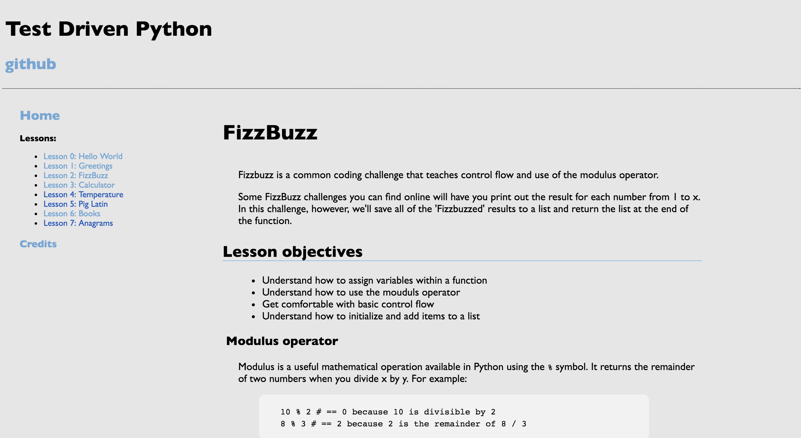
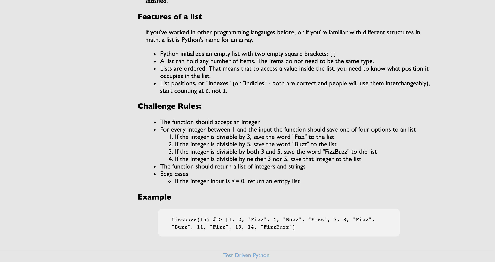

# [fit] Test Driven Python!

^ My alumna project from Write/Speak/Code

---

## Who is this for?
- Beginning coders
- Aspiring polyglots
- Teachers

---

## Objectives
- Teach python basics
- Progressively harder lessons
- Teach TDD principles by doing

---
## Initial design:
 

---
## Initial design continued

---

## Tests!

---

## Conference accomplishments

- Regained momentum on project
- Styling help (Thanks Stephanie!)
- Decided on next several lessons
- Set next steps

---

## Next steps

- Flesh out lessons
- Get feedback from coding newbies
- Get feedback from non-Python coders
- Get feedback from other Python teachers
- Schedule Chicago PyLadies intro to python workshop

---

## Links

- These slides: [github.com/thejessleigh/talks](https://github.com/thejessleigh/talks/python_talks/tdp)
- TDP Repo: [github.com/thejessleigh/test\_driven\_python](https://github.com/thejessleigh/test_driven_python)

   
[@JLUnrein](https://twitter.com/JLUnrein) | [jessunrein.com](http://jessunrein.com)