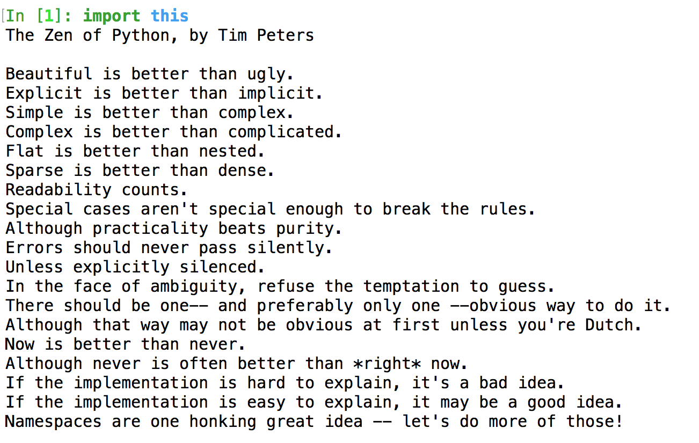
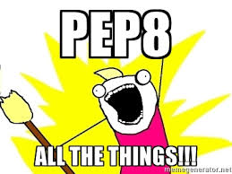
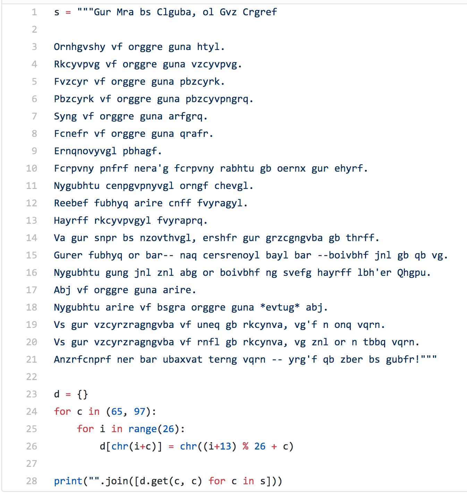

footer: \#CoderConference | @JLUnrein

# **The Zen of Python in Practice**

## Balancing Idealism With Production Concerns

^ My name is Jess Unrein and I'll be talking to you today about the difference between thinking you've internalized best practices and standards, and then having to live out in the wild with long running code.

^ Intended audience - anyone who has ever worked in Python or wants to work in Python. This talk will hopefully be accessible to beginners but resonate with people who have worked with Python in production before.

^ I'm a software engineer at Sprout Social, and a lot of the code we run is built on foundations that were laid five or six years ago. To me, this is a legacy codebase. The code is older than my career. There are, I'm sure, people here who hardly consider a five year old codebase to be legacy code, and others who are working at start ups who hope to make it to the point where you're complaining about five year old kludge. We have a bad habit in the dev community for taking things like the definition of "legacy codebases" and turning them into shibboleths for who's the baddest OG Guru in town, and that has a bad habit of erasing the truth of the shit we all have to deal with day to day.

^ I believe that once you stop active development on a feature of your codebase, it becomes a legacy. The second it stops occupying your full attention in active development, the second you have to start maintaining, the second it becomes something you work *around* rather than work *on*, that's when you're dealing with legacy code. Even those of you out there who are working on totally greenfield endeavors are going to be working on legacy code soon. You'll soon find out that your worst enemy is your own past code.

---

# The Beautiful Dream

^ I remember when I first started learning to code. My first language was acutally Ruby, not Python. I found all sorts of resources that constantly reassured me of the beauty and simplicity of Ruby, about how it was written for developer comfort, creativity, and expression.

^ When I went to Dev Bootcamp in January of 2014, we learned more of the same. Their motto was "Make Beautiful and Meaningful Things" and we studied up on refactoring and nitpicking our own greenfield projects, and each project languished unused after the deadline was up.

^ I wrote my first line of Python on the first day of my job right out of Dev Bootcamp. I studied up a bit, and the main resources my coworkers gave me to learn about The Pythonic Way was to check out `import this`. I had no idea what they were getting at.

---

# `import this`

^ For those of you who are uninitiated, typing `import this` into the Python shell outputs a collection of aphorisms that I like to think of as a poem (although there are a lot of people who would probably disagree with me on that.) called the Zen of Python. Some of the lines are inside jokes, but a lot of what the Zen of Python has to say are common sense ideas to apply when writing up a new project.

^ But although Ruby and Python have different design philosophies, this collected wisdom has a similar problem to the "developer comfort and creativity" ethos of Ruby. It's designed fort the developer of a new project. Once a codebase reaches the level of needing maintainance, proceeding along these guidelines is suddenly a lot less clear.

---

^ Quick readthrough of the Zen of Python

^ This is what the Zen of Python looks like printed out on screen. We'll talk about some of these items today - the advice bits, not the joke bits.

^ But don't be fooled. Even though there are joke bits, a framed cross stitch was auctioned for over $300 at a PyCon event this year. People take the `this` module very very seriously.

^ Let's imagine you're a fresh hire at a company and need to delve into a new-to-you codebase. It might have started with the best of intentions, but over the years, things have gotten muddy.

^ BUT. But. You know better. You've been to conferences and seen talks on best practices. You've read PEP-8 (python's official core style guide that everyone theoretically follows.) And anyway, Python is a whitespace language, so how messy can it be, really?

---

# `Readability Counts`

^ The first thing that you notice is that there are lines that are 200 characters long littered all over your models file. This is obviously a PEP-8 violation. It makes it hard to read. If you're anything like Sprout, the half joking solution that actually materialized was to buy all the developers extra wide monitors so that they can expand the window to read the extra long lines.

^ But how hard could it be, really, to just shorten all the lines to the recommended 79 characters? It's not technically a structural change.

^ You also notice that there's only one line in between function declarations outside of a class, when obviously there should be two. Right thinking people follow PEP-8 on this because readability counts, right? It's easier to see when things begin and end if everyone follows the same conventions you get an obvious visual break to let you know when you've reached the end, especially if the function doesn't return anything useful, or has multiple possible returns nested in a large chunk of control flow.

^ What's even better is that your company bought you a license to PyCharm, which has a fancy Command-Option-L shortcut that automagically PEP-8s everything for you. You wonder why no one else has thought of this before. After all, readability counts, and you're just making life better for everyone, right?

---

### (*but so does the blame line*)

^ Well. Readability counts. But so does the blame line.

^ You've committed the code, and now for every mistake that might be in that 700 line file you auto-formatted, your face is next to it on github. Whether or not you understand the code. Whether or not you've ever even really touched it before. You're now on the hook because no one wants to dig through history, especially if the last 7 commit messages on that line are just "misc PEP-8 fix". And that's assuming that you didn't mix in any functional changes in that auto-formatting commit. Because we all always have beautiful, atomic, non-breaking commits, right?

---

# `There should be one-- and preferably only one --obvious way to do it.`

^ So PEP-8ing all the things and fixing readability didn't go great for you. Hopefully someone clued you in before you merged that pull request and saved you one heck of a headache. You go back to closing out your feature stories and occasional bug fixes, a little more cautious. But you're a good developer. There are still things you can do to make this codebase better, you just need to get your coworkers to see the light.

^ You notice that you have a simple helper function, maybe it does something with converting time strings to epochs, maybe it involves generating a UUID. Something. And there are two or three different ways it's implemented scattered around the code. One of the implementations even has a five year old comment in the docstring that says something like "//TEMPORARY HACK - FIX THIS SOON". You check the blame line, and the person who wrote it left four years ago and no one knows why they thought this implementation was so bad. In fact it seems like the cleanest, most stable one. So while you're working on some tech debt, you decide to find all the usages in the codebase for all the different implementations, and switch them over to one of the funcitons, that way there is a canonical implementation in your codebase and people can stop getting weird bug tickets every quarter resulting from inconsistencies between your helper funcitons.

^ This is, after all, the most Pythonic principle there is. There should be one-- and prefereably only one --obvious way to do it. Don't repeat yourself. All that good stuff. Everyone on your team agrees with you, so you move everything over to your shiny new canonical helper function, and you notice a dramatic decrease in bugs as a result of your clever change.

---

# *Inter-team dependencies* and *crazy edge cases*

^ But the devops team, (or another section of the Python team that you never talk to, just somone), it turns out, had been relying on a subtle side effect from one of the helper functions you erased that only applies in leap years. Or something like that. And several months after you make your change, they come to you and you broke this one very specific use case that no one else in engineering even knew about. And you have to either revert back to having multiple functions that do almost identical things, introduce a weird side effect into your beautiful helper function that's going to make all of the fuctional programming diehards on your team die a little death inside, or you have to introduce yet more helper functions for crazy use cases that seem like there must be an easier way to solve for and it's turtles all the way down.

^ This is the second time you've tried to do something clever and clean to make things better, and it just keeps on not working out for you.

^ *If time permits here, talk about flat is better than nested and balancing creating single use helper functions versus having large nested functions.*

---

# What now?

^ So you kept trying to do the Technically Right Thing and you got shot down every time. Does this mean that advice and standards are all BS? That you shouldn't try? Is everything terrible forever and we're all doomed to Legacy Code Hell? Heck no.

^ Believe it or not I'm actually a huge fan of the Zen of Python. But I think the way we teach newcomers to a codebase about approaching legacy code is all backwards. We take these common sense aphorisms way too seriously and apply good advice in foolish ways sometimes.

^ So I've drafted my own little addendum to the Zen of Python specifically for this.

---

# Zen and the Art of Legacy Code Maintenance

^ I call it Zen and the Art of Legacy Code Maintenance.

^ There are a few pitfalls that each of the previous examples fell into. Here are a couple new rules to help avoid those common mistakes.

---

# `You can't clean code you don't understand`

^ It's okay to PEP-8 things as you go! Readability still does count!

^ But you can't and shouldn't clean up things that you don't hvae a thorough understanding of. If you're anything like me, you find it physically painful to look at Python that doesn't follow consistent line break rules. Or that puts a slew of arguments into a function definition without some common sense readability indentation so you don't have to have crazy wide special monitors like we do at Sprout Social.

^ But I would never dream of changing those things that kill me a little inside if I didn't have a thorough understanding of what it is I was touching. Even if they're non-structural formatting changes. Because I don't want to be on the hook for something I can't explain, or at least figure out, to somone else.

---

# `If it works, don't poke it.`

^ Assume the best of intentions from your current and former coworkers when reviewing old code. If it seems like there's a slew of antipatterns and craziness happening in a large block, there's probably a reason they felt they had to do it that way instead of cleaning up as they went. Your coworkers (hopefully) reviewed that pull request and agreed that there wasn't a better way to do it in the time allotted. If it's been running for a substantial period of time and it's not causing you endless bug tickets, leave it alone and let it do its job.

^ I really believe that the reason Python refers to Zen so much is sometimes you have to learn to let things go.

---

# `Ask questions, but don't insult your predecessors`

^ This isn't strictly a code quality aphorism. But it is good advice.

^ I see things in slack channels and github issues all the time where people ask questions (often referring to the blame line) and insinuate - intentionally or not - that the person who wrote that code was an idiot. I don't know about you, but I'm less likely to give someone a helpful answer when someone addresses my code that way. I'm not perfect. Neither are you.

^ Phrase your questions with the empathy that you would want to bestow on your past self. None of us emerged from the womb knowing about the performance differences between using a constructor versus declaring a variable as a literal. Be helpful and informative, and don't assume that someone else should know something just because you happened to stumble on the knowledge yourself.

---

# `Code maintenance is kindergarten soccer-- a team sport and we don't keep score`

^ Again, not strictly a code quality bit of advice, but solid all the same.

^ It breaks my heart a little bit when I hear about teams where whoever commits a bug has to bring in doughnuts to the office. Doughnuts should be fun, they aren't punishment. And the development and care of a codebase is a shared responsibility. You might have pushed a bug to prod, but your team reviewed that code. Hopefully the code went through some sort of QA process. Laying blame doesn't get anyone anywhere, and leads to slower and more painful production fixes.

^ If something breaks, chip in to get it fixed. Don't keep score when Jerry or Amanda break the app, because you won't like it so much when they do the same to you. And definitely don't hold small mistakes over your juniors' head. We don't need bright people getting chased out of the field with petty competitive BS.

^ Bring in dougnuts for breakfast because you like your team.

---

# `Public park rules - leave things nicer than when you arrived`

^ If you're working on something and you *do* happen to spot a minor change that would clean things up again - changing a variable name to be more descriptive, removing deprecated and unused helper functions (be sure to quadruple check first!) then you absolutely *should* take those things out. You should always assume the positive intentions of the people who came before you, but that doesn't mean they're infallible. Trust your instincts, unit tests, and code reviewers. You're not in this alone, and that means you have a responsibility to clean up the trash you see laying around in the codebase. It's what you'd want others to do for you. :smile:

---

# `Cuss up a storm in your comments`

^ It's okay to make messy mistakes and have fun. My favorite internal Sprout tool (that I think all companies should implement) is a universal code searcher that searches for string matches in all of our github and bitbucket repos. Not only is it super useful for seeing if pieces of old code are in use, it provides endless amusement. One of my favorite things to do when I have a spare minute is to search for cuss words in the codebase and check out what's happening. It's a great tool for learning, and what are comments for if not having a bit of fun at your own expense?

^ It might seem silly, or even inappropriate, but honestly, leaving a breadcrumb trail of F bombs can help your coworkers or your future self identify a problematic piece of code that can be cleaned up in the future.

---

### Any guesses as to what this is?

^ This is the source code to the module that prints out the Zen of Python. It's the English text, but in the Ceaser cipher.

---

# *Fun Fact*

## Even the Zen of Python source code violates the Zen of Python

### You cannot tell me that this is not needlessly complicated :dizzy_face:

^ Every time you type import this, this monstrous string has to be deciphered before it goes out onto your screen.

^ It's, of course, supposed to be cute. It's a joke for anyone who is enterprising enough to look up the source code for themselves.

^ And I think it points to an important thing that we often overlook. These aphorisms and guidelines that we all clearly adhere to and defend, these are guidelines that mostly live in well manicured and small side projects. They're the best foot we put forward when we show off our code to the world, but they're not meant to be taken as deadly serious.

^ There will probably never be a production codebase worth its salt that doesn't implement the same functionality at least two different ways. And that's okay.

^ We can make things better as we go one small clean up at a time. Anyone who's worked on a deadline before knows that you can't let the perfect be the enemy of the good. But with enough practice, dedication, and good humor, we don't have to let the adequate be the enemy of the good either.

---

# Thank you!

### Slides available at [github.com/thejessleigh/talks](https://github.com/thejessleigh/talks)
